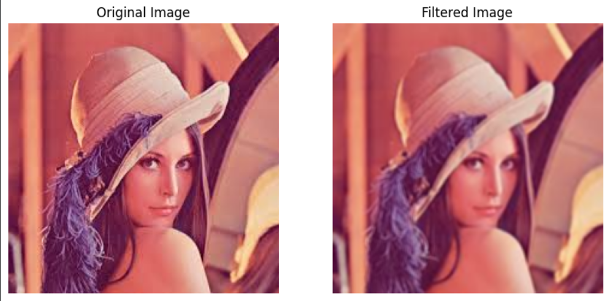

# 📊 3×3 Box Filter (Moving Average Filter) – DSP & VLSI Implementation

## 📌 Overview

This project implements a 3×3 moving average (box) filter for image processing applications. The design is explored across both software and hardware domains.

* Python implementation for image processing
* Verilog implementation for hardware realization
* Pipelined architecture for high throughput
* Folded architecture for reduced hardware usage

---

## 🧠 Key Concepts

* Digital Signal Processing (DSP)
* Image Filtering (Spatial Domain)
* Pipelining in VLSI
* Folding Transformation
* RTL Design & Simulation

---

## 🖥️ Software Implementation

The filter is implemented using Python with NumPy and OpenCV.
It applies a 3×3 averaging kernel to smooth images.

---

## ⚙️ Hardware Implementation

The design is implemented in Verilog HDL:

* 3-stage pipelined architecture
* Synthesized using Xilinx Vivado
* Verified using testbench simulation

---

## 📊 Results

|  |


---

## 📈 Performance Insights

* Pipelining improves throughput (1 output/cycle)
* Folding reduces hardware usage (single adder reuse)
* Trade-off between latency and area

---

## 📂 Project Structure

```
python/     → Python simulation  
verilog/    → RTL + Testbench  
results/    → Output images & waveforms  
report/     → IEEE paper  
```

---

## 📚 References

* K. K. Parhi, *VLSI DSP Systems*
* Gonzalez, *Digital Image Processing*
* IEEE CVPR Papers on Image Filtering

---

## 👨‍💻 Authors

* Sharvil Pingale
* Advait Rao
* Anish Shende

---
